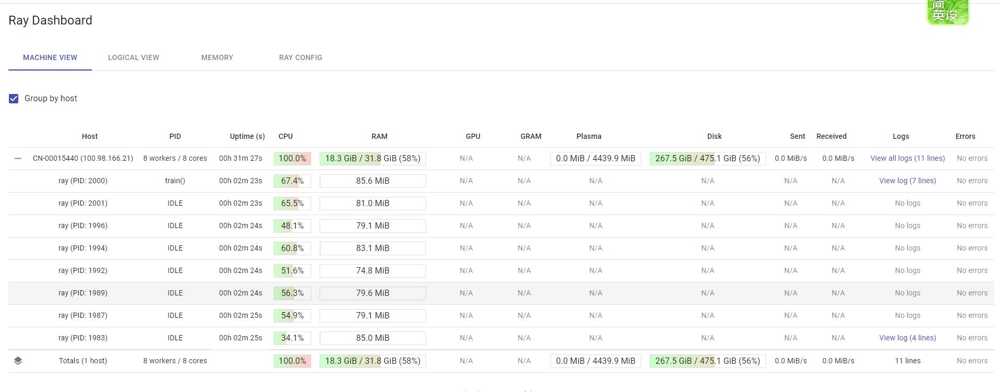
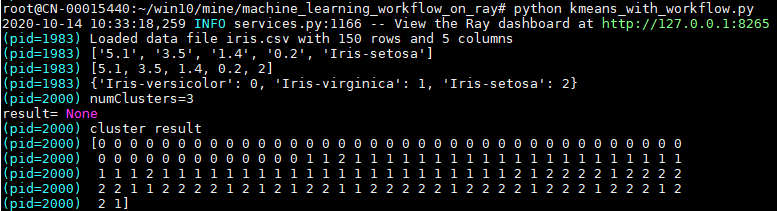

# machine_learning_workflow_on_ray

## Purpose
For demostrating how to apply workflow to machine learning system.

## Demo





## Run

based on python 3.6.8

```
pip install -r requirement.txt

python kmeans_with_workflow.py
```

open http://127.0.0.1:8265 on browser to watch runing process.
